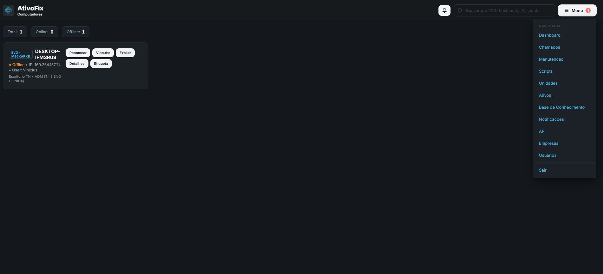
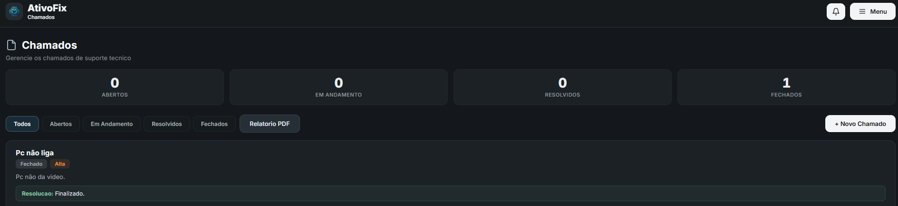
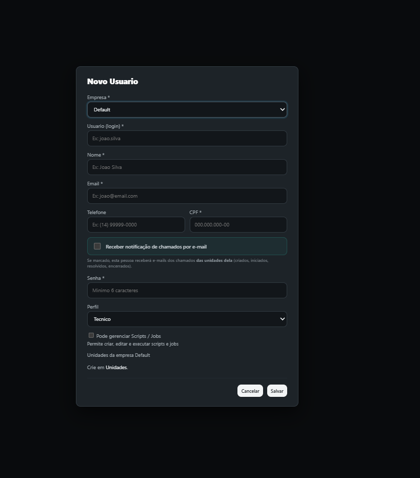
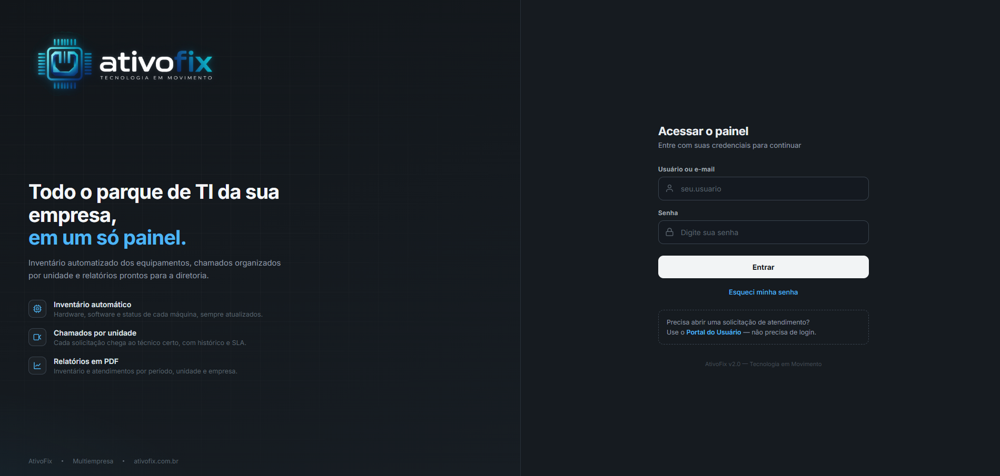
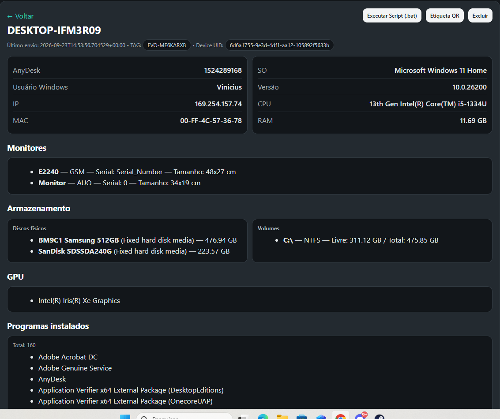

<div align="center">


# AtivoFix

**Gestão de TI completa: inventário automático, help desk e relatórios em um só painel**

*Software real, em produção, resolvendo um problema real de operação de TI.*


[Funcionalidades](#-o-que-o-sistema-faz) · [Demonstração](#-demonstração) · [Arquitetura](#️-arquitetura) · [Destaques técnicos](#-destaques-técnicos) · [API](#-api-rest) · [Instalação](#-rodando-localmente)

</div>

---

## 💡 Por que este projeto existe

Em empresas com várias unidades, a equipe de TI costuma trabalhar "no escuro": não sabe quantas máquinas tem, onde estão, quem usa, nem o que está quebrado. Inventário em planilha desatualiza, chamados se perdem no WhatsApp e relatórios para a diretoria são manuais.

O **AtivoFix** resolve isso de ponta a ponta:

> Um agente leve instalado nos PCs **reporta hardware e software sozinho**, os chamados chegam **organizados por unidade com SLA**, e a diretoria recebe **relatórios PDF prontos** — tudo isolado por empresa, no mesmo servidor.

**E não é um protótipo:** roda em produção, com agente distribuído nas máquinas, HTTPS, serviço systemd e backup automático.

---

## 📦 O que o sistema faz

| Módulo | O que entrega |
|---|---|
| 🖥️ **Inventário automático** | Agente Windows coleta CPU, RAM, disco, GPU, SO, monitores, programas instalados, IP/MAC e usuário — sem digitar nada |
| 🎫 **Chamados (Help Desk)** | Portal público sem login, cascata Empresa → Unidade → Local, prioridade, SLA, anexos e pesquisa de satisfação (CSAT) |
| 🏢 **Multi-tenant** | Várias empresas no mesmo servidor, com isolamento total de dados entre elas |
| 👥 **Perfis e escopo** | Admin Master, Admin da Empresa, Admin da Unidade e Técnico — cada um só vê o que é seu |
| 📄 **Relatórios PDF** | Inventário e chamados com marca, filtros por período/unidade, prontos para a diretoria |
| 🔧 **Automação remota** | Execução de scripts `.bat` nos PCs gerenciados, direto do painel |
| 📊 **Dashboard** | KPIs em tempo real, máquinas offline, chamados por unidade, gráficos |
| 🔔 **Notificações** | E-mail por unidade: cada gestor recebe só os chamados da sua operação |
| 🔐 **Segurança** | bcrypt, rate limiting, CSP/HSTS, chaves de API guardadas apenas como hash |

---

## 📸 Demonstração

### 🔐 Login

<p align="center">
  
</p>

<p align="center">
  <em>Identidade visual própria, com design system global aplicado a todas as 25+ telas.</em>
</p>

### 🖥️ Painel de inventário

<p align="center">
  
</p>

<p align="center">
  <em>Cada máquina com status online/offline em tempo real, TAG, usuário e ações administrativas.</em>
</p>

### 🔍 Detalhes do ativo

<p align="center">
  
</p>

<p align="center">
  <em>Ficha completa por máquina: SO, CPU, RAM, armazenamento, GPU, monitores, programas instalados, IP, MAC e identificadores — tudo coletado pelo agente, sem intervenção humana.</em>
</p>

### 🎫 Gestão de chamados

<p align="center">
  
</p>

<p align="center">
  <em>Ciclo completo de atendimento: abertura, prioridade, status, histórico, anexos e resolução.</em>
</p>

### 📨 Portal do usuário

<p align="center">
  
</p>

<p align="center">
  <em>Usuário final abre chamado sem login, escolhendo empresa → unidade → local em cascata.</em>
</p>

### 👥 Controle de usuários

<p align="center">
  
</p>

<p align="center">
  <em>Usuários, empresas, unidades e permissões com escopo hierárquico por papel.</em>
</p>

### 📄 Relatórios

<p align="center">
  
</p>

<p align="center">
  <em>PDF gerado no servidor com a marca do cliente e filtros por período e unidade.</em>
</p>

---

## 🏗️ Arquitetura

```
┌──────────────┐   HTTPS    ┌─────────────────────────────────────────┐
│ Agente (PCs) │──────────► │              VPS (Ubuntu)               │
│  agente.py   │  /api/...  │  ┌─────────┐  ┌──────────────────────┐  │
└──────────────┘            │  │  Nginx  │─►│ Gunicorn × Flask     │  │
                            │  │ + TLS   │  │     (server.py)      │  │
┌──────────────┐            │  └─────────┘  └──────────┬───────────┘  │
│  Navegador   │──────────► │                          │              │
│ Painel/Portal│            │              ┌───────────▼───────────┐  │
└──────────────┘            │              │      SQLite (WAL)     │  │
                            │              └───────────────────────┘  │
┌──────────────┐            │  SMTP → notificações e recuperação      │
│ Sistema do   │──X-API-KEY─└─────────────────────────────────────────┘
│ cliente      │  /api/v1/...
└──────────────┘
```

**Stack:** Python · Flask · SQLite (WAL) · Gunicorn · Nginx + TLS · systemd · Chart.js · fpdf2 · bcrypt · PyInstaller · SMTP · cron

---

## ⭐ Destaques técnicos

Os problemas de engenharia que este projeto me obrigou a resolver:

**Backend e modelagem**
- **Multi-tenancy com isolamento real** — toda query é escopada por empresa; nenhuma rota vaza dados entre tenants
- **Hierarquia de acesso em 4 níveis** (Admin Master → Empresa → Unidade → Técnico), aplicada no backend e refletida na UI
- **API versionada** (`/api/v1`) com autenticação por chave: o banco guarda apenas o **hash SHA-256** da chave, exibida uma única vez

**Automação e agente**
- **Agente Windows em Python** que coleta inventário completo (CPU, RAM, disco, GPU, monitores, softwares, rede) e conversa com o servidor via HTTPS
- **Distribuição sem atrito**: empacotado com PyInstaller, configuração persistente em `C:\ProgramData` — atualizar o `.exe` não perde o vínculo da máquina
- **Execução remota de scripts** `.bat` nas máquinas gerenciadas, a partir do painel

**Infraestrutura e operação**
- **Produção em Linux VPS**: Nginx (reverse proxy + TLS/Let's Encrypt) → Gunicorn → Flask
- **Serviço systemd** com auto-start, logs centralizados no journald
- **Backup automático** do banco via cron, firewall UFW, headers de segurança (CSP, HSTS) e rate limiting
- **Pipeline de marca própria**: scripts que regeneram favicons, logos, cache-busting de assets e até cartaz A4 300 DPI com QR Code para divulgar o portal no cliente

---

## 🤖 Agente Windows

```text
Computador Windows
       │
       ├── CPU · RAM · Disco · SO
       ├── Programas instalados
       ├── Monitores · GPU
       └── IP · MAC · usuário · TAG
              │
              ▼
        agente.py (PyInstaller)
              │
            HTTPS
              │
              ▼
        AtivoFix API  ──►  Dashboard + Alertas
```

Desenvolvimento:

```bash
pip install -r requirements-agent.txt
python agente.py        # modo console
```

Distribuição: `AtivoFix-Agente-Windows.zip` na [aba Releases](https://github.com/Vinenuness/ativofix/releases) → instalar, informar a **TAG** da máquina e pronto.

---

## 🔌 API REST

Integração para sistemas externos (ERP, helpdesk do cliente) — **isolada por empresa** via `X-API-KEY`:

| Método | Rota | Descrição |
|---|---|---|
| `GET` | `/api/v1/ping` | Testar a chave |
| `GET` | `/api/v1/computers` | Máquinas da empresa (unidade, local, status) |
| `GET` | `/api/v1/units` | Unidades + contagens |
| `GET` | `/api/v1/locations` | Locais por unidade |
| `GET` | `/api/v1/tickets` | Chamados (filtros: `status`, `since`, página) |
| `POST` | `/api/v1/tickets` | **Abrir chamado** pelo sistema do cliente |

```python
import requests

r = requests.post(
    "https://ativofix.com.br/api/v1/tickets",
    headers={"X-API-KEY": "afk_..."},
    json={
        "title": "Impressora não imprime",
        "priority": "high",
        "unit_name": "Unidade Garça",
        "location_name": "triagem",
    },
)
print(r.json())   # {"ok": true, "ticket_id": 23}
```

---

## 🚀 Rodando localmente

```bash
# 1. Clonar
git clone https://github.com/Vinenuness/ativofix.git
cd ativofix

# 2. Ambiente virtual
python -m venv .venv
.venv\Scripts\activate          # Windows
# source .venv/bin/activate     # Linux/Mac

# 3. Dependências
pip install -r requirements.txt

# 4. Rodar
python server.py
```

Painel em `http://localhost:5000` · Portal público de chamados em `/abrir-chamado`

> ⚙️ Credenciais e segredos ficam no `.env` (veja `.env.example`) — nada sensível é versionado.

---

## 🗂️ Estrutura do projeto

```
ativofix/
├── server.py                   # entrypoint (importa a app Flask)
├── agente.py                   # agente de coleta Windows
├── templates/                  # aplicação (APP_DIR aponta para cá)
│   ├── server.py               # servidor Flask completo
│   ├── *.html                  # 25+ telas (painel, portal, relatórios...)
│   ├── static/
│   │   ├── brand.css           # design system global
│   │   └── logo*.png           # kit da marca (web, print, dark)
│   ├── agente.py               # agente de coleta
│   └── _*.py                   # scripts de marca/cache/assets
├── deploy/
│   ├── ativofix.service        # unidade systemd
│   └── nginx-ativofix.conf     # reverse proxy + TLS
├── DEPLOY.md                   # guia de produção
├── requirements*.txt           # dependências (servidor / prod / agente)
└── instalar-agente.ps1         # instalador do agente
```

---

## 🗺️ Roadmap

- [ ] Expandir testes automatizados
- [ ] Monitoramento em tempo real (WebSocket)
- [ ] Novos indicadores de SLA
- [ ] Observabilidade e métricas
- [ ] Evolução do agente (auto-update)

---

## 👨‍💻 Sobre este projeto

O AtivoFix nasceu de um problema real de operação de TI e cresceu para cobrir **inventário, help desk, automação, multi-tenancy, infraestrutura e segurança** — as mesmas áreas que um time de tecnologia lida todos os dias.

**TI • Desenvolvimento • Infraestrutura • Automação • Suporte**

---

## 🔗 Links

**GitHub:** https://github.com/Vinenuness/ativofix
**Website:** https://ativofix.com.br

---

<div align="center">


**AtivoFix — Tecnologia em Movimento.**

</div>
