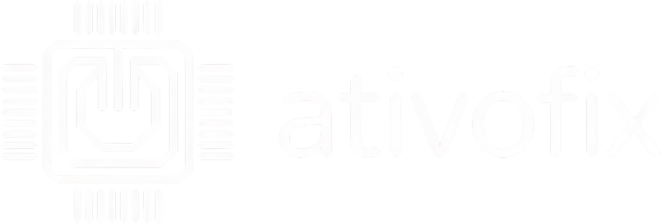
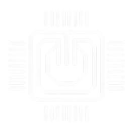

<div align="center">



**Tecnologia em Movimento**

*Gestão de inventário de TI e chamados para empresas multi-unidade*


[Funcionalidades](#-funcionalidades) · [Arquitetura](#-arquitetura) · [Instalação](#-instalação) · [Produção](#-deploy-em-produção) · [API](#-api-pública-v1) · [Agente](#-agente-windows)

</div>

---

## 📦 O que é

O **AtivoFix** centraliza todo o parque de TI da empresa em um só painel:

- **Inventário automático** — um agente leve instalado nos PCs reporta hardware, software e status em tempo real
- **Chamados organizados por unidade** — usuários abrem chamados pelo portal público e cada solicitação chega ao técnico certo, com SLA, histórico e anexos
- **Estrutura hierárquica** — Empresa → Unidade → Local, com isolamento total entre empresas (multi-tenant)
- **Relatórios profissionais** — PDF com marca, filtro por período/unidade, prontos para a diretoria

## ✨ Funcionalidades

| Módulo | Recursos |
|---|---|
| 🖥️ **Inventário** | Coleta automática de CPU, RAM, disco, SO e programas; status online; etiqueta TAG por máquina |
| 🎫 **Chamados (OS)** | Portal público sem login; cascata Empresa→Unidade→Local; prioridade e SLA; anexos (fotos/prints); CPF; CSAT |
| 🏢 **Multi-tenant** | Várias empresas no mesmo servidor; usuários, unidades, locais e máquinas isolados por empresa |
| 👥 **Usuários** | Papéis hierárquicos (Admin Master, Admin da Empresa, Admin da Unidade, Técnico); escopo por unidade — cada um só vê o que é dele |
| 📄 **Relatórios** | PDF de inventário e de chamados com cabeçalho/rodapé da marca; filtros por período e unidade |
| 🔧 **Scripts remotos** | Execução de scripts `.bat` nos PCs gerenciados |
| 📊 **Dashboard** | KPIs em tempo real, gráficos, máquinas offline, chamados por unidade |
| 🔔 **Notificações** | E-mail por unidade: cada gestor recebe só os chamados da sua operação |
| 🔐 **Segurança** | bcrypt, rate limiting, headers CSP/HSTS, chaves de API com hash |
| 📣 **Divulgação** | Cartaz A4 300 DPI com QR Code do portal, na identidade da marca |

## 🏗️ Arquitetura

```
┌──────────────┐   HTTPS    ┌─────────────────────────────────────────┐
│ Agente (PCs) │──────────► │              VPS (Ubuntu)               │
│  agente.py   │  /api/...  │  ┌─────────┐  ┌──────────────────────┐  │
└──────────────┘            │  │  Nginx  │─►│ Gunicorn × Flask     │  │
                            │  │ + TLS   │  │     (server.py)      │  │
┌──────────────┐            │  └─────────┘  └──────────┬───────────┘  │
│  Navegador   │──────────► │                          │              │
│ Painel/Portal│            │              ┌───────────▼───────────┐  │
└──────────────┘            │              │      SQLite (WAL)     │  │
                            │              └───────────────────────┘  │
┌──────────────┐            │  SMTP → notificações e recuperação      │
│ Sistema do   │──X-API-KEY─└─────────────────────────────────────────┘
│ cliente      │  /api/v1/...
└──────────────┘
```

**Stack:** Python · Flask · SQLite · Gunicorn · Nginx · Chart.js · fpdf2 · bcrypt · PyInstaller

## 🚀 Instalação (desenvolvimento)

```bash
# 1. Clonar
git clone https://github.com/Vinenuness/ativofix.git
cd ativofix/templates

# 2. Ambiente virtual
python -m venv .venv
.venv\Scripts\activate          # Windows
# source .venv/bin/activate     # Linux/Mac

# 3. Dependências
pip install -r ../requirements.txt

# 4. Rodar
python server.py
```

O painel sobe em `http://localhost:5000` e o portal público de chamados em `/abrir-chamado`.

> ⚙️ As credenciais e segredos ficam no `.env` (veja `.env.example`) — nada sensível é versionado.

## 📦 Deploy em produção

Guia completo em **[DEPLOY.md](DEPLOY.md)**. Resumo do fluxo na VPS:

```bash
cd /opt/ativofix && git pull          # atualizar código
systemctl restart ativofix            # serviço systemd (auto-start no boot)
journalctl -u ativofix -f             # logs
```

Componentes: **systemd** (serviço sempre ativo) · **Nginx + Let's Encrypt** (HTTPS) · **UFW** (firewall) · **cron** (backup diário do banco às 03:00).

## 🔌 API pública v1

Integração para sistemas externos (ERP, helpdesk do cliente) — **isolada por empresa** via chave `X-API-KEY`:

| Método | Rota | Descrição |
|---|---|---|
| `GET` | `/api/v1/ping` | Testar a chave |
| `GET` | `/api/v1/computers` | Máquinas da empresa (unidade, local, status) |
| `GET` | `/api/v1/units` | Unidades + contagens |
| `GET` | `/api/v1/locations` | Locais por unidade |
| `GET` | `/api/v1/tickets` | Chamados (filtros: `status`, `since`, página) |
| `POST` | `/api/v1/tickets` | **Abrir chamado** pelo sistema do cliente |

```python
import requests

r = requests.post(
    "https://ativofix.com.br/api/v1/tickets",
    headers={"X-API-KEY": "afk_..."},
    json={
        "title": "Impressora não imprime",
        "priority": "high",
        "unit_name": "HSL Garca",
        "location_name": "triagem",
        "cpf": "000.000.000-00",
    },
)
print(r.json())   # {"ok": true, "ticket_id": 23}
```

Gerencie as chaves no painel (**Menu → API**): gerar, desativar e ver último uso. A chave é exibida uma única vez; no banco existe apenas o hash SHA-256.

## 💻 Agente Windows

Coleta inventário e executa scripts remotos. Compilado com PyInstaller.

```bash
pip install -r requirements-agent.txt
python agente.py                  # modo console p/ desenvolvimento
```

Distribuição: baixe o **`AtivoFix-Agente-Windows.zip`** na [aba Releases](https://github.com/Vinenuness/ativofix/releases) → instalar e informar a **TAG** da máquina. A configuração fica em `C:\ProgramData\AgenteTI` — atualizar o `.exe` não perde o vínculo.

## 🗂️ Estrutura do projeto

```
ativofix/
├── templates/                  # aplicação (APP_DIR aponta para cá)
│   ├── server.py               # servidor Flask completo
│   ├── *.html                  # 25 telas (painel, portal, relatórios...)
│   ├── static/
│   │   ├── brand.css           # design system global (todas as páginas)
│   │   ├── logo*.png           # kit da marca (web, print, dark)
│   │   └── divulgacao/         # cartaz A4 + arte digital (QR code)
│   ├── agente.py               # agente de coleta
│   └── db.sqlite3              # banco local (não versionado)
├── deploy/
│   ├── ativofix.service        # unidade systemd
│   └── nginx-ativofix.conf     # reverse proxy + TLS
├── DEPLOY.md                   # guia de produção
├── requirements*.txt           # dependências (servidor / prod / agente)
└── instalar-agente.ps1         # instalador do agente
```

## 🛠️ Manutenção

Scripts utilitários em `templates/` (rodar com o Python da venv):

| Script | Função |
|---|---|
| `_rebrand_assets.py` | Regenera todo o kit da marca a partir de `static/brand-src/` |
| `_gen_favicon.py` | Gera o kit de favicons multi-tamanho |
| `_cache_bust.py` | Versiona os assets (`?v=`) em todas as páginas — rode após trocar qualquer asset |
| `_gen_poster.py` | Gera o cartaz A4 300 DPI e a arte digital com QR code |
| `_gen_social_preview.py` | Gera o social preview 1280×640 do repositório |

## 📄 Licença

© 2026 **AtivoFix** — Tecnologia em Movimento. Todos os direitos reservados.

<div align="center">

</div>
